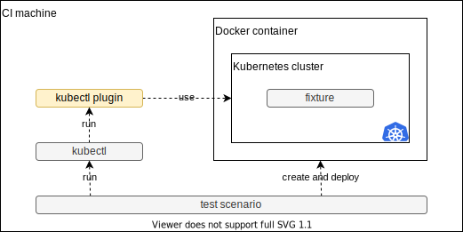

# kubectl-tree-e2e-test 

This is an end-to-end test of [kubectl-tree](https://github.com/ahmetb/kubectl-tree).
It shows how to test a kubectl plugin with a real Kubernetes cluster on CI.


## How it works

This test runs with the following stack:



The test scenario is written in [Makefile](Makefile).
It create a Kubernetes cluster using [Kind](https://kind.sigs.k8s.io) and deploy the [fixture](fixture.yaml).
After deployment, it runs `kubectl tree` and check its output.

It is run on GitHub Actions. See the [workflow](.github/workflows/test.yaml).


## Run locally

You need to set up Docker and Kind.

```sh
# install deps
kubectl krew install tree

# run the test
make

# clean up
make delete-cluster
```

## Conrtibution

This is an open source software.
Feel free to open issues and pull requests.
